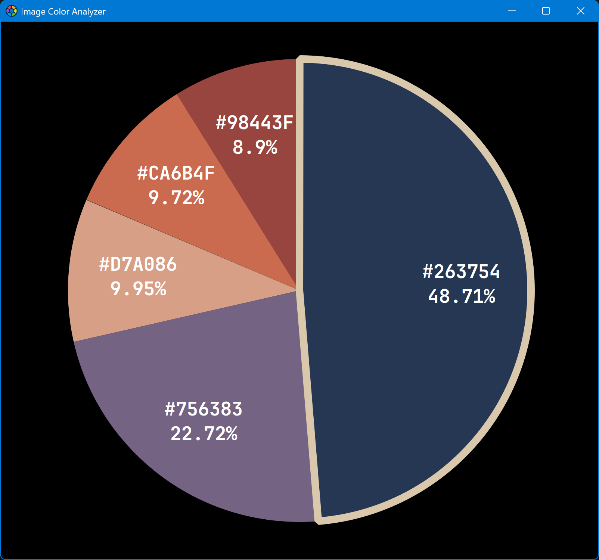
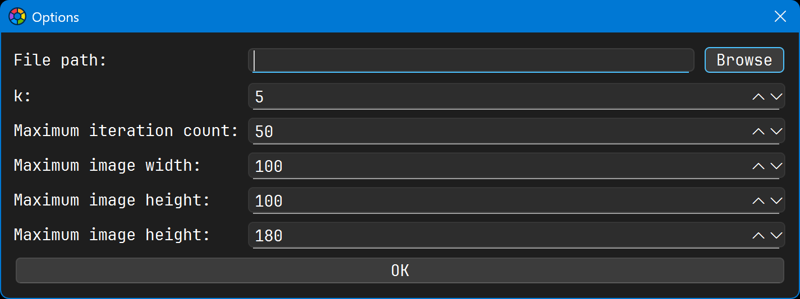

# Image Color Analyzer

A small GUI tool to analyze the main colors of a given image. Based on Qt & C++.

You can use this tool to find out which color is the most dominant color of a given image.

Please be advised that this tool is specifically designed to analyze images with a multitude of colors, where the dominant color cannot be directly determined by the naked eye. If you use it to examine images with solid colors or an exceptionally small number of colors (e.g., a total of no more than 10 colors), the tool will not function properly.

Please be advised that this tool is only intended for rough data estimation and is not specifically designed for precise scientific calculations or analysis. Under no circumstances should this tool be used in serious academic settings or similar environments.

## Snapshots



## Usage

First, run the program. You will see a completely blank window — this is normal. You need to click anywhere in the window with the left mouse button (or simultaneously press the CTRL key and the O key on the keyboard). At this point, a small dialog box will appear. After you have filled in all the parameters appropriately, click the OK button with the left mouse button to start the analysis. The analysis results will be displayed in the form of a pie chart within the window. You can press the F5 key on the keyboard to re-analyze using the same parameters, or simultaneously press the CTRL key and the C key to copy the current analysis result (i.e., the pie chart) to the clipboard.



Field Name | Value Type | Default Value | Description
-- | -- | -- | --
File path | string | N/A | The file path of the image you want to analyze. Only local file paths can be accepted, URLs are not allowed.
k | number | 5 | This number determines how many groups the colors in the image will be divided into. Generally speaking, having too many groups (e.g., more than 20) or too few groups (e.g., fewer than 4) may prevent you from accurately identifying the color with the highest proportion (though this does not matter if you only wish to observe the overall color distribution). The recommended range is [4, 8], and the default value of 5 is suitable for most cases. There is no need to change this parameter unless necessary.
Maximum iteration count | number | 50 | This is the upper limit on the number of iterations for the internal algorithm, serving as a safeguard to prevent infinite loops. In general, the algorithm will stop after approximately 20 iterations. Therefore, if this number is set too low (e.g., less than 10), the final result may lack accuracy. However, since the internal algorithm automatically stops iterating once certain conditions are met, setting this number excessively high (e.g., over 50) is also not very meaningful.
Maximum image width | number | 100 | If the input image's width exceeds this value, it will be automatically downscaled to meet this limit. This significantly accelerates the overall analysis process without substantially affecting the accuracy of the final results. If this value is set to zero or a negative number, the original image will not be resized.
Maximum image height | number | 100 | Same as above, but only applied to the image height.
Alpha threshold | number | 180 | Semi-transparent colors contribute less to the overall appearance of the image, so we need to disregard those with low contribution. If this value is within the range (0, 255), only colors with an alpha value greater than or equal to this threshold will be considered valid; otherwise, they will be ignored. If you set a value outside this range, no colors will be filtered out (though regardless, the alpha channel of all colors will be disregarded, and they will be treated as fully opaque by the algorithm).

## License

```text
MIT License

Copyright (C) 2025 by wangwenx190 (Yuhang Zhao)

Permission is hereby granted, free of charge, to any person obtaining a copy
of this software and associated documentation files (the "Software"), to deal
in the Software without restriction, including without limitation the rights
to use, copy, modify, merge, publish, distribute, sublicense, and/or sell
copies of the Software, and to permit persons to whom the Software is
furnished to do so, subject to the following conditions:

The above copyright notice and this permission notice shall be included in all
copies or substantial portions of the Software.

THE SOFTWARE IS PROVIDED "AS IS", WITHOUT WARRANTY OF ANY KIND, EXPRESS OR
IMPLIED, INCLUDING BUT NOT LIMITED TO THE WARRANTIES OF MERCHANTABILITY,
FITNESS FOR A PARTICULAR PURPOSE AND NONINFRINGEMENT. IN NO EVENT SHALL THE
AUTHORS OR COPYRIGHT HOLDERS BE LIABLE FOR ANY CLAIM, DAMAGES OR OTHER
LIABILITY, WHETHER IN AN ACTION OF CONTRACT, TORT OR OTHERWISE, ARISING FROM,
OUT OF OR IN CONNECTION WITH THE SOFTWARE OR THE USE OR OTHER DEALINGS IN THE
SOFTWARE.
```
